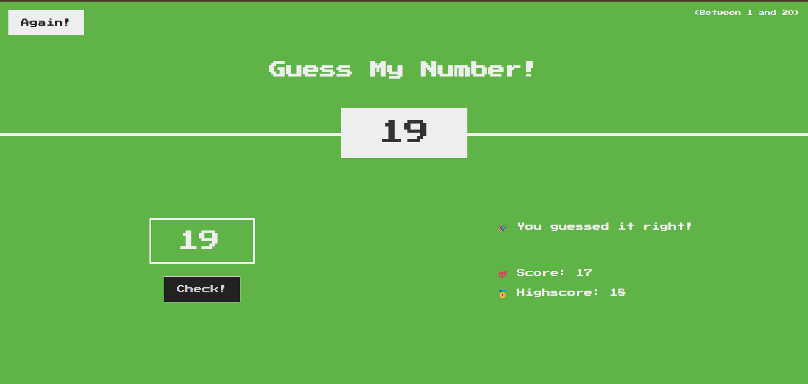

# Guess My Number! 🤔

A simple JavaScript game where players try to guess a randomly generated number between 1 and 20. This project is perfect for practicing fundamental JavaScript skills, DOM manipulation, and event handling.

<br>


---

## 📝 Features

- Random number generation for each game session.
- User-friendly interface with input validation.
- Feedback provided for each guess (e.g., "Too High", "Too Low").
- Tracks the player's score and updates dynamically.
- Reset functionality to play again without refreshing the page.

---

## 🚀 How to Play

1. Clone or download this repository.
2. Open the **_index.html_** file in your preferred browser.
3. Follow these steps to play:
   - Enter a number between 1 and 20 in the input box.
   - Click the "Check" button to see if your guess is correct.
   - The game will tell you if your guess is too high, too low, or spot-on!
4. Try to guess the correct number in as few attempts as possible.

---

## 🔧 Technologies Used

- HTML5: Structuring the user interface.
- CSS3: Styling the game for an engaging experience.
- JavaScript: Core game logic and interactivity.

---

## 🛠️ Installation

1. Clone the repository to your local machine:

```bash
git clone https://github.com/nedaagehad/guess-my-number.git
```

2. Navigate to the project folder:

```bash
cd guess-my-number
```

3. Open the game in your browser:

```bash
open index.html
```

---

## 🎨 Game Status Examples

Here’s what the game looks like in different scenarios:

- **Too High**
  

  <br>

- **Too Low**
  

  <br>

- **Correct Guess**
  

<br>

- **Lost Game**
  

---

## 🌟 Acknowledgments
* Inspired by beginner-friendly JavaScript projects.
* Built with passion for learning and fun!
